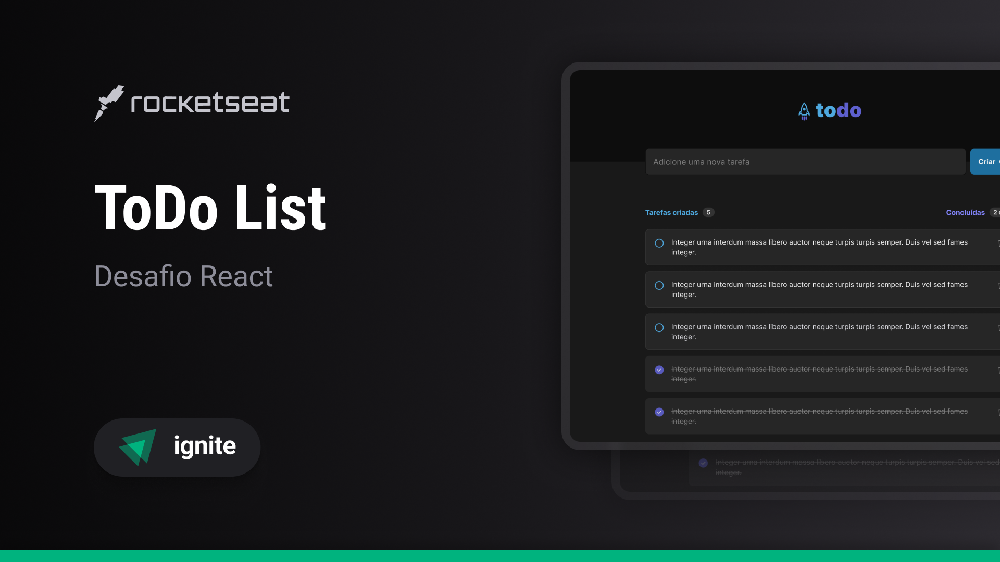

<h1 align="center"> ToDo list -Paulo Henrique </h1>

Desafio número 01 do modulo Ignite promovido pela Rocketseat  
<a href="https://www.rocketseat.com.br/?utm_source=google&utm_medium=cpc&utm_campaign=lead&utm_term=perpetuo&utm_content=institucional-lead-home-texto-lead-brandkws-none-none-institucional-none-none-br-google&gclid=Cj0KCQjwiIOmBhDjARIsAP6YhSVOkUmTjdncykyC6YoWWYExafcXX-z-BmauUqN8HlbIKf__iCm6k3YaAglBEALw_wcB">Site da Rocketseat</a>

  <a href="#-tecnologias">Tecnologias</a>&nbsp;&nbsp;&nbsp;|&nbsp;&nbsp;&nbsp;
  <a href="#-projeto">Projeto</a>&nbsp;&nbsp;&nbsp;|&nbsp;&nbsp;&nbsp;
  <a href="#-layout">Layout</a>&nbsp;&nbsp;&nbsp;|&nbsp;&nbsp;&nbsp;
  <a href="#memo-licença">Licença</a>

  

 

  

## 🚀 Tecnologias

Esse projeto foi desenvolvido com as seguintes tecnologias:

- HTML e CSS
- JavaScript
- Git e Github
- Figma
- React Js 
  => Hooks (useStage())
  => Components 
  => Components properties

## 💻 Projeto

O desafio 01 é uma ToDo list, um programa de gerenciador de tarefas, onde você pode acrescentar, alterar o status e excluir tarafas que achar relevante. 

- O projeto foi melhorado e acrescentado uma função para salvar no localStorage e seu progresso não seja perdido com a atualização de página.

## 🔖 Layout

Você pode visualizar o layout do projeto através [DESSE LINK](https://www.figma.com/file/1qcifpWG5TgWx81fPXAUOE/ToDo-List-%E2%80%A2-Desafio-React-Copy?fuid=1189009741987769829). É necessário ter conta no [Figma](https://figma.com) para acessá-lo.

## :memo: Licença

Esse projeto está sob a licença MIT.

---

Feito com ♥ by Rocketseat :wave: [Participe da nossa comunidade!](https://discord.gg/rocketseat)
